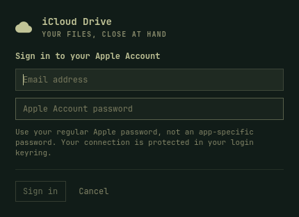

# Cloud Drives for Omarchy

Your cloud files, in your file manager. Connect iCloud Drive, Google Drive,
and OneDrive from a panel that follows your Omarchy theme.

A development fork of [edbron's Cloud Drives](https://github.com/edbron/omarchy-cloud-drives).
This milestone improves iCloud onboarding and recovery. It retains the upstream
plugin ID: install **either this fork or upstream**, not both. This fork is not
a separate marketplace listing.

## What is new

- Native iCloud account and verification screens inside the Omarchy panel.
- Preparation through Omarchy's normal terminal and package prompt.
- A Reconnect action, visible errors, progress, and Open folder after mounting.
- A separate encrypted configuration for each provider, leaving existing rclone setups alone.
- Staged iCloud authentication: failure or cancellation preserves the current account.

Google Drive and OneDrive retain their browser sign-in via a floating terminal.



Preview rendered from the native Omarchy components, with placeholder fields.

## Development status

This is a development preview. Tests exercise the protocol with simulated Apple
responses and a pinned local rclone. Real Apple sign-in, trusted-device approval,
and a cross-device file round trip are required before release. See
[validation](docs/VALIDATION.md).

## Install for testing

Requires Omarchy 4 (Quattro). Review the development branch, then:

```sh
git clone --branch feature/native-icloud-onboarding \
  https://github.com/m17kea/omarchy-cloud-drives.git \
  ~/.config/omarchy/plugins/edbron.cloud-drives
omarchy plugin validate ~/.config/omarchy/plugins/edbron.cloud-drives
omarchy-shell shell rescanPlugins
omarchy plugin enable edbron.cloud-drives
```

If upstream is installed, unmount its drives before replacing the checkout.
This fork does not migrate the old shared rclone configuration automatically.
Reconnect accounts in the new panel. Do not run both versions' services together.

## Connect iCloud

1. Click the cloud in the bar, then **Connect** beside iCloud Drive.
2. Prepare this computer if prompted. Return to the panel and check again.
3. Enter your Apple Account email and **regular account password**.
4. Enter the verification code or approve access on your trusted Apple device.
5. Open `~/Cloud/iCloudDrive` when the mount is ready.

App-specific passwords do not work with rclone's iCloud backend.
Advanced Data Protection can remain enabled: allow iCloud web access and approve
the trusted-device request. [Current rclone documentation](https://rclone.org/iclouddrive/).

Sessions generally need renewing after about 30 days. **Reconnect** authenticates
in a temporary encrypted config and verifies access before stopping the old mount
and replacing its credentials. The mount then starts with the new session.

## Mounts and caching

Drives appear at `~/Cloud/iCloudDrive`, `~/Cloud/GoogleDrive`, and `~/Cloud/OneDrive`.
Content downloads as you open files. Writes use rclone's disk cache and upload in
the background. This is a cached network filesystem, not a full offline mirror
or a conflict-resolving sync engine. Uncached files need a connection.

The panel reports **mounted**, not that all pending writes reached the cloud.
Close applications before unmounting; retain the cache until uploads are confirmed.
Use independent backups and test concurrent edits before using critical files.

## Credentials and local files

The login keyring stores a random encryption key under
`service=omarchy-cloud-drives key=config-password`. rclone reads it through
`RCLONE_PASSWORD_COMMAND`. Each provider config is encrypted and mode 0600.
Apple's password is stored obscured inside that encrypted file with its session
credentials. Native input travels over stdin and a private Unix socket, never
process arguments. The helper emits curated status messages instead of raw
authentication responses.

| Location | Purpose |
| --- | --- |
| `$XDG_CONFIG_HOME/omarchy-cloud-drives/<Remote>.conf` | Separate encrypted provider configs |
| `$XDG_CONFIG_HOME/systemd/user/omarchy-cloud-drive@.service` | User mount service |
| `$XDG_CACHE_HOME/omarchy-cloud-drives` | Cached files and pending uploads |
| `$XDG_RUNTIME_DIR/omarchy-cloud-drives-*` | Temporary private authentication state |
| `~/Cloud/<Remote>` | Mount points |

XDG config/cache paths default to `~/.config` and `~/.cache`. No global rclone
configuration or `environment.d` settings are modified. Cached file content is
plaintext, restricted to your user. A cache identity stored inside each encrypted
configuration isolates accounts: a different iCloud account gets a different
cache, while reconnecting the same account retains pending writes. Old caches
are retained for recovery and are not automatically deleted.

Dependencies: rclone **1.75.1+**, fuse3, Python 3, libsecret (`secret-tool`), an
unlocked login keyring, gum, jq, curl, and systemd. Preparation installs rclone
and fuse3 with `omarchy pkg add`; other dependencies normally ship with Omarchy.

## Commands and removal

```sh
bin/omarchy-cloud-drives state
bin/omarchy-cloud-drives setup
bin/omarchy-cloud-drives connect icloud
bin/omarchy-cloud-drives reconnect icloud
bin/omarchy-cloud-drives mount icloud
bin/omarchy-cloud-drives unmount icloud
bin/omarchy-cloud-drives open icloud
```

Other provider IDs are `google` and `onedrive`. Inspect mount failures with
`systemctl --user status omarchy-cloud-drive@iCloudDrive.service` and
`journalctl --user -u omarchy-cloud-drive@iCloudDrive.service --since today`.

To remove: close files, confirm uploads in the cloud, **Forget** each connected
account, then run `omarchy plugin remove edbron.cloud-drives`. Forget stops the
service before removing that account's credentials. The service template,
configuration files, keyring entry and cache are retained; disabled instances
do not start. Remove retained data only after confirming uploads. Older upstream
shared rclone/environment files are not managed by this fork.

## Develop

```sh
python3 -m unittest discover -s tests -v
bash -n bin/omarchy-cloud-drives
omarchy plugin validate .
```

See [design notes](docs/DESIGN.md) and [validation](docs/VALIDATION.md).
MIT, retaining the original copyright. Original plugin by edbron; native iCloud
onboarding and recovery in this fork by Michael Armitage and contributors.
